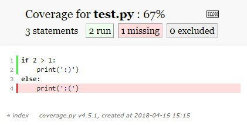

# Coverage

`coverage` is a simple tool that can tell which part of your code was run and which was not during program execution. It's usually useful for unit-testing to detect parts that are probably not tested thoroughly enough.

Say, we need coverage result for the following script:

```python {no-print}
if 2 > 1:
    print(':)')
else:
    print(':(')
```

After we install `coverage` with `pip install coverage` we just run:

```bash
$ coverage run test.py
:)
```

As a result, the `.coverage` file is created in the current directory. Now we want to see the actual report:

```bash
$ coverage report
Name      Stmts   Miss  Cover
-----------------------------
test.py       3      1    67%
```

It says that out of three statements we have, one was never executed (hence total coverage is ~67%).

For prettier and more detailed representation we can use `coverage html`:


