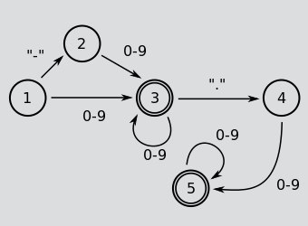

# FSM

A regular language is a formal language that can be recognized by a finite-state machine
([FSM](https://en.wikipedia.org/wiki/Finite-state_machine)).
That means that reading text, character by character,
you only need memory to remember current state, and the number of such states is finite.

The beautiful and simple example is a machine that checks whether an input is a simple number like `-3`, `2.2` or `001`.
The following diagram is an FSM diagram. Double circles mean *accept states*, they identify where the machine can stop.

